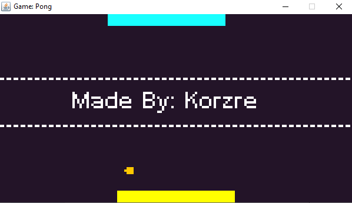

# Game: Pong
<table><tr><td>
    
</td></tr></table>

<h2>This game was developed in java.</h2>

This project is a faithful recreation of the arcade classic Pong, specifically designed to explore AI development in a 1 vs Machine environment. Built with Java, the game features a CPU agent that uses real-time tracking and position prediction to compete against the player. Key technical aspects include pixel-perfect collision detection, vector-based reflection physics, and state management to handle smooth gameplay transitions between the menu and the match.

Good luck :)

Note: In the AI part was not used any kind of frameworks.

<h4>Used Tools</h4>
<ul>
<li>Eclipse</li>
</ul>
